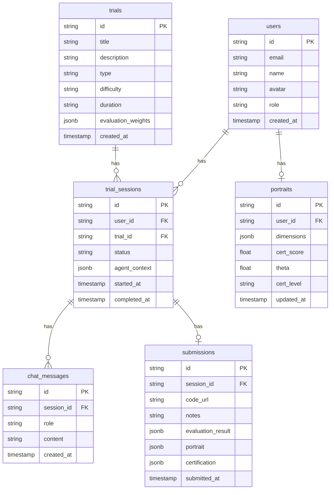

## 1. 架构设计

```mermaid
graph TB
    subgraph "前端层"
        "React + Vite + Tailwind"
        "ReactBits 组件库"
        "ECharts 图表"
    end
    subgraph "后端层"
        "Express API Server"
        "EMA 评估引擎"
        "AI 评审服务"
    end
    subgraph "数据层"
        "Supabase PostgreSQL"
        "Supabase Auth"
    end
    subgraph "外部服务"
        "OpenAI 兼容 API"
        "SenseAudio LLM"
    end
    "React + Vite + Tailwind" --> "Express API Server"
    "Express API Server" --> "Supabase PostgreSQL"
    "Express API Server" --> "OpenAI 兼容 API"
    "EMA 评估引擎" --> "Supabase PostgreSQL"
    "AI 评审服务" --> "OpenAI 兼容 API"
```

## 2. 技术说明
- 前端：React 18 + TypeScript + Vite + Tailwind CSS
- 初始化工具：vite-init (react-express-ts 模板)
- 后端：Express 4 + TypeScript (ESM)
- 数据库：Supabase (PostgreSQL)
- AI 服务：OpenAI 兼容 API（SenseAudio 或其他）
- 状态管理：Zustand
- 图表：ECharts + echarts-for-react
- 组件库：ReactBits + UI-Layouts（按需引入）
- 图标：lucide-react

## 3. 路由定义
| 路由 | 用途 |
|------|------|
| `/` | 首页 Landing Page |
| `/trials` | 试炼大厅 |
| `/trials/:id` | 试炼进行中（Agent 对话） |
| `/profile/:id` | 个人画像页 |
| `/cert/:id` | 认证证书页 |

## 4. API 定义

### 4.1 试炼相关
```typescript
// GET /api/trials - 获取试炼列表
interface Trial {
  id: string;
  title: string;
  description: string;
  type: 'hackathon' | 'case_study' | 'code_review';
  difficulty: 'beginner' | 'intermediate' | 'advanced';
  duration: string;
  participants: number;
  status: 'active' | 'upcoming' | 'completed';
}

// POST /api/trials/:id/start - 开始试炼
interface StartTrialResponse {
  sessionId: string;
  agentGreeting: string;
}

// POST /api/trials/:id/submit - 提交试炼
interface SubmitTrialRequest {
  sessionId: string;
  codeUrl: string;  // GitHub PR 链接
  notes?: string;
}
```

### 4.2 画像相关
```typescript
// GET /api/profile/:id - 获取用户画像
interface Profile {
  id: string;
  name: string;
  avatar: string;
  portrait: {
    curiosity: number;        // 好奇心 0-100
    reliability: number;      // 靠谱
    factChecking: number;     // 事实洁癖
    diverseThinking: number;  // 多元化思维
    uncertaintyTolerance: number; // 忍受不确定性
    lowEgoHighDrive: number;  // 低ego高自驱
  };
  certification: {
    level: 'C1' | 'C2' | 'C3' | null;
    certScore: number;
    theta: number;
    issuedAt: string;
  };
  trialHistory: {
    trialId: string;
    title: string;
    score: number;
    completedAt: string;
  }[];
}
```

### 4.3 Agent 对话相关
```typescript
// POST /api/chat - Agent 对话（SSE 流式输出）
interface ChatRequest {
  sessionId: string;
  message: string;
}

// SSE 事件流
// data: { type: 'token', content: '...' }
// data: { type: 'evaluation', scores: {...} }
// data: { type: 'done', portrait: {...} }
```

### 4.4 评估引擎
```typescript
// POST /api/evaluate - AI 评估
interface EvaluateRequest {
  trialId: string;
  sessionId: string;
  submission: {
    codeDiff: string;
    commitHistory: string[];
    duration: number;
  };
}

interface EvaluateResponse {
  dimensions: {
    technical: number;      // D1 技术实现 0-100
    completeness: number;   // D2 方案完整度
    innovation: number;     // D3 创新与问题解决
    collaboration: number;  // D4 协作与沟通
    aiToolUsage: number;    // D5 AI 工具应用
  };
  portrait: Record<string, number>;  // 六维画像
  certification: { level: string; score: number; };
  feedback: string;
}
```

## 5. 数据模型

### 5.1 数据模型定义


### 5.2 建表语句
```sql
-- 用户表（由 Supabase Auth 管理，此表为扩展信息）
CREATE TABLE profiles (
  id UUID PRIMARY KEY REFERENCES auth.users(id),
  email TEXT NOT NULL,
  name TEXT NOT NULL,
  avatar TEXT,
  role TEXT DEFAULT 'candidate' CHECK (role IN ('candidate', 'investor')),
  created_at TIMESTAMPTZ DEFAULT NOW()
);

-- 试炼表
CREATE TABLE trials (
  id UUID PRIMARY KEY DEFAULT gen_random_uuid(),
  title TEXT NOT NULL,
  description TEXT NOT NULL,
  type TEXT NOT NULL CHECK (type IN ('hackathon', 'case_study', 'code_review')),
  difficulty TEXT NOT NULL CHECK (difficulty IN ('beginner', 'intermediate', 'advanced')),
  duration TEXT NOT NULL,
  evaluation_weights JSONB DEFAULT '{"technical": 0.4, "completeness": 0.2, "innovation": 0.2, "collaboration": 0.05, "aiToolUsage": 0.15}',
  created_at TIMESTAMPTZ DEFAULT NOW()
);

-- 试炼会话
CREATE TABLE trial_sessions (
  id UUID PRIMARY KEY DEFAULT gen_random_uuid(),
  user_id UUID NOT NULL REFERENCES profiles(id),
  trial_id UUID NOT NULL REFERENCES trials(id),
  status TEXT DEFAULT 'active' CHECK (status IN ('active', 'submitted', 'evaluated', 'completed')),
  agent_context JSONB DEFAULT '{}',
  started_at TIMESTAMPTZ DEFAULT NOW(),
  completed_at TIMESTAMPTZ
);

-- 聊天消息
CREATE TABLE chat_messages (
  id UUID PRIMARY KEY DEFAULT gen_random_uuid(),
  session_id UUID NOT NULL REFERENCES trial_sessions(id),
  role TEXT NOT NULL CHECK (role IN ('user', 'assistant', 'system')),
  content TEXT NOT NULL,
  created_at TIMESTAMPTZ DEFAULT NOW()
);

-- 提交记录
CREATE TABLE submissions (
  id UUID PRIMARY KEY DEFAULT gen_random_uuid(),
  session_id UUID NOT NULL REFERENCES trial_sessions(id),
  code_url TEXT,
  notes TEXT,
  evaluation_result JSONB,
  portrait JSONB,
  certification JSONB,
  submitted_at TIMESTAMPTZ DEFAULT NOW()
);

-- 画像表
CREATE TABLE portraits (
  id UUID PRIMARY KEY DEFAULT gen_random_uuid(),
  user_id UUID NOT NULL REFERENCES profiles(id),
  dimensions JSONB NOT NULL,
  cert_score FLOAT DEFAULT 0,
  theta FLOAT DEFAULT 0,
  cert_level TEXT CHECK (cert_level IN ('C1', 'C2', 'C3')),
  updated_at TIMESTAMPTZ DEFAULT NOW()
);

-- 初始试炼数据
INSERT INTO trials (title, description, type, difficulty, duration) VALUES
('AI Agent 黑客松', '48小时内完成一个AI Agent项目，从零到可运行的MVP。Agent将实时观察你的编码行为并评估底层能力。', 'hackathon', 'intermediate', '48小时'),
('RAG 系统搭建', '构建一个检索增强生成系统，展示你的技术深度和AI工具运用能力。', 'hackathon', 'advanced', '24小时'),
('代码审查挑战', '审查并改进一段生产级代码，展示你的工程素养和问题发现能力。', 'code_review', 'beginner', '4小时');
```
